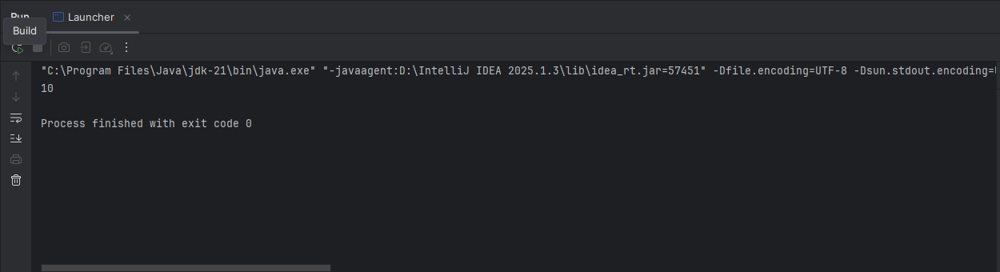
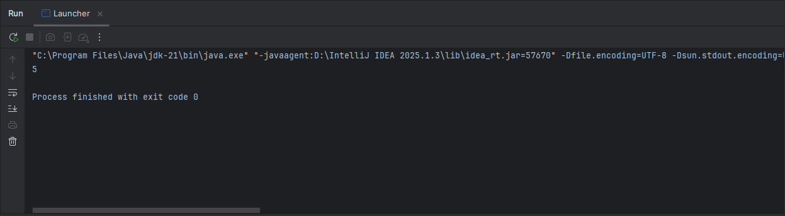
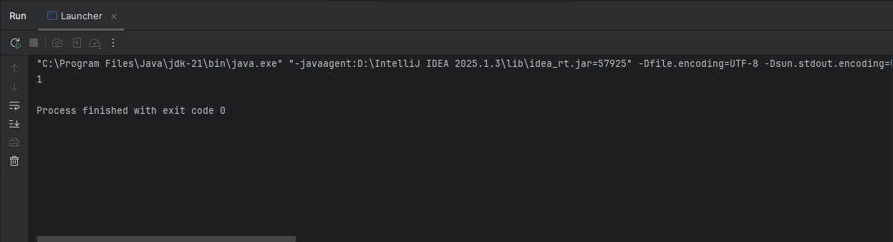
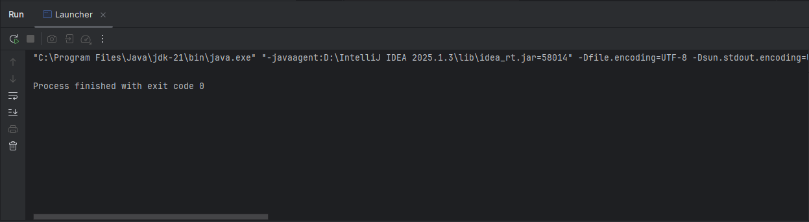
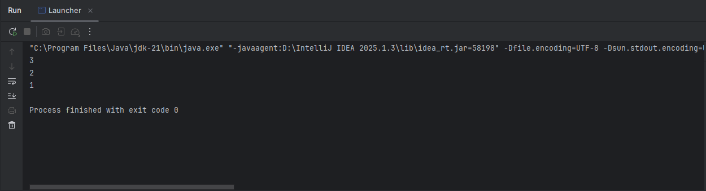
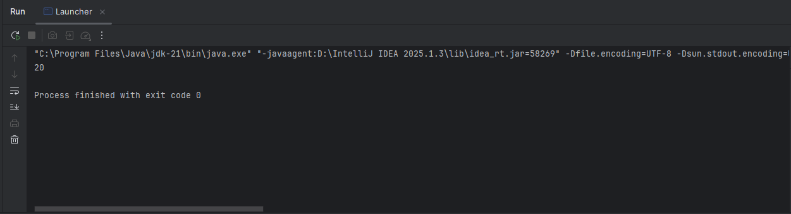
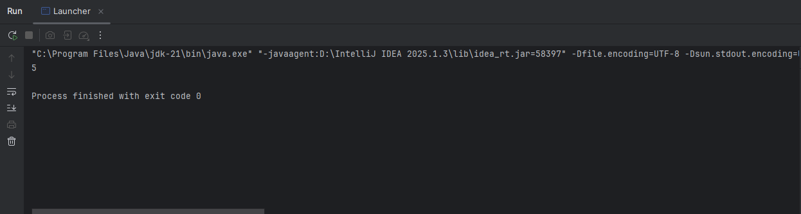
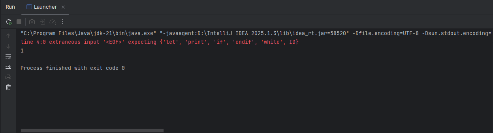
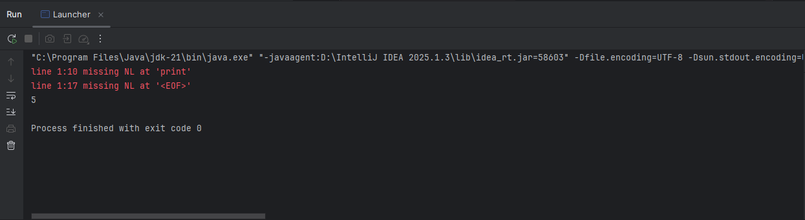
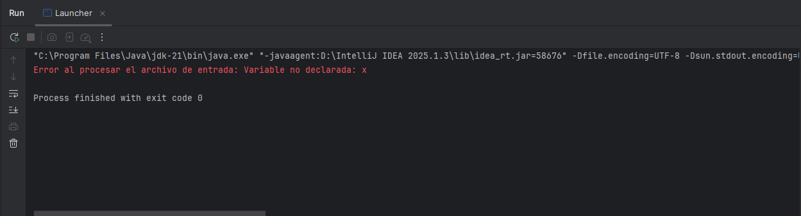

# Tarea 3 - Introducción al Patrón Visitor en ANTLR4
## Eduardo González González - 2213064505
## Universidad Autónoma Metropolitana

### Ejercicio 2: Traductor de un lenguaje simple
`Descripción:` Crea un pequeño lenguaje llamado MiniLang y traduce su código (ya sea USANDO Java
o Python en MyVisitor) mediante ANTLR4 y el patrón Visitor.

### Gramática sugerida
````antlrv4
grammar MiniLang;

programa : instruccion+ EOF ;

instruccion
    : 'let' ID '=' expr NL         # Declaracion
    | ID '=' expr NL               # Asignacion
    | 'print' expr NL              # Imprimir
    | 'if' expr 'then' NL
        instruccion+
      'endif' NL                   # If
    | 'while' expr 'do' NL
        instruccion+
      'endwhile' NL                # While
    ;

expr
    : expr op=('*'|'/') expr       # MulDiv
    | expr op=('+'|'-') expr       # AddSub
    | '(' expr ')'                 # Parentesis
    | NUMERO                       # Literal
    | ID                           # Variable
    ;

NUMERO : [0-9]+ ;
ID     : [a-zA-Z_][a-zA-Z0-9_]* ;
NL     : '\r'? '\n' ;
WS     : [ \t]+ -> skip ;
````
### Preguntas didácticas ❓
* `¿Cómo aseguras la precedencia?`
  
    La precedencia de operadores se asegura directamente en la gramática (MiniLang.g4) mediante la forma en que se definen las reglas expr.
  ANTLR permite definir la precedencia al organizar las reglas de manera jerárquica, de lo más fuerte a lo más débil:
    ````antlrv4
  expr
  : expr op=('*'|'/') expr   # MulDiv
  | expr op=('+'|'-') expr   # AddSub
  | '(' expr ')'             # Parentesis
  | ID                       # Variable
  | NUMERO                   # Literal
  ;
  ````

    Por ejemplo, como * y / están definidos antes que + y -, tendrán mayor precedencia. Así, una expresión como 2 + 3 * 4 se interpreta correctamente como 2 + (3 * 4).
    Además, los paréntesis (( )) se usan explícitamente para alterar la precedencia por parte del usuario, como en cualquier lenguaje convencional.


* `¿Qué limitaciones tiene este traductor actualmente?`
  * Sólo maneja números enteros (int); no soporta tipos como booleanos, cadenas o flotantes. 
  * No existe control de errores detallado: si una variable no ha sido declarada, lanza una excepción, pero no se proporciona un mensaje de contexto más amigable. 
  * Las expresiones sueltas que no están dentro de una instrucción válida (como x - 1) no se permiten, lo que limita la flexibilidad. 
  * No permite funciones, arreglos ni estructuras más complejas (como bloques anidados con scopes locales). 
  * El sistema de tipos es inexistente: todo se trata como int sin validaciones.


* `Podrías usar JavaScript en vez de Java ¿qué cambiaría?`
    
  Sí, podríamos usar JavaScript en lugar de Java para implementar el visitor, ya que ANTLR4 soporta generación de código en varios lenguajes, incluyendo JavaScript.
  
    Cambiaría principalmente lo siguiente:
  
    El archivo `MiniLang.g4` seguiría igual, pero la generación se haría con el backend de JavaScript usando:
    ````bash
  antlr4 -Dlanguage=JavaScript MiniLang.g4
  ````
  Se escribiría un archivo .js en lugar de .java, implementando el visitor como una clase o función con métodos como visitAsignacion, visitPrint, etc.

    El manejo del árbol sintáctico, la memoria (Map → usaría un Object o Map en JS), y los errores serían en sintaxis JS.
  
    La lógica general no cambia demasiado, pero hay diferencias en sintaxis, manejo de clases, módulos, y errores.


* `¿Por qué es importante separar el parser del visitor?`
  
  Separar el parser del visitor es crucial por varias razones:

    * Modularidad: el parser se encarga solo de construir el árbol sintáctico (estructura del código), mientras que el visitor define qué hacer con ese árbol (ejecutar, traducir, analizar, etc.).

    * Reutilización: puedes reutilizar el mismo parser para diferentes fines: crear un intérprete, un compilador, un verificador, o incluso una herramienta de refactorización.

    * Mantenimiento: permite modificar o extender el visitor (por ejemplo, agregar soporte para booleanos o funciones) sin tocar la gramática.

    * Separación de responsabilidades: mejora el diseño del programa, ya que la sintaxis y la semántica están claramente diferenciadas.

## Pruebas
**NOTA** ❗❗❗

Para agregar el archivo de entrada, se hizo clic derecho en Launcher.java, después
en More Run/Debug, después en Modify Run Configuration y en argumentos agregar el nombre del
archivo de texto en este caso entrada.txt, debe de estar en la raíz del proyecto.

* **Prueba 1: Declaración y uso de variable** 
    ````text
    let a = 10
    print a
    ````
    **Salida:**
    


* **Prueba 2: Declaración y uso de variable**
    ````text
    let x = 3
    x = x + 2
    print x
    ````
  **Salida:**
  


* **Prueba 3: if con condición verdadera (valor distinto de cero)**
    ````text
    let a = 1
    if a then
    print a
    endif

    ````
  **Salida:**
  


* **Prueba 4: if con condición falsa (0)**
    ````text
    let a = 0
    if a then
    print a
    endif
    ````
  **Salida:**
  


* **Prueba 5: Ciclo while con contador fijo)**
    ````text
    let n = 3
    while n do
    print n
    n = n - 1
    endwhile
    ````
  **Salida:**
  


* **Prueba 6: Uso de paréntesis para controlar la precedencia**
    ````text
   let res = (2 + 3) * 4
    print res
    ````
  **Salida:**
  


* **Prueba 7: División entera**
    ````text
   let a = 20
    let b = 4
    let c = a / b
    print c
    ````
  **Salida:**
  


* **Prueba 8: if sin endif**
    ````text
    let x = 1
    if x then
    print x
    ````
  **Salida:**
  


* **Prueba 9: Instrucción sin salto de línea**
    ````text
    let x = 5 print x
    ````
  **Salida:**
  


* **Prueba 10: Variable no declarada**
    ````text
    x = 10
    print x
    ````
  **Salida:**
  

